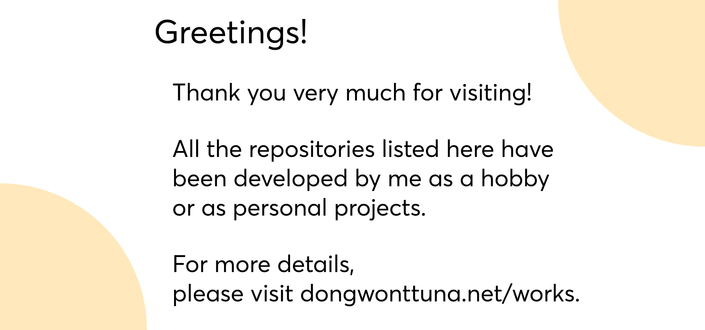
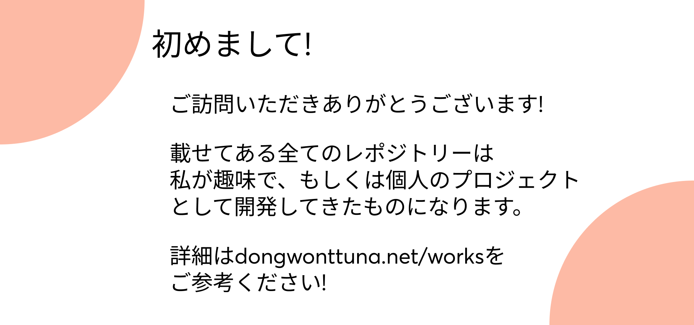

# @DongwonTTuna

## Greetings to Visitors! ー ご挨拶

>)
>)
 
 
 

## Frontend works ー フロントエンドの作品

#### to be implemented

 
 
 

## Backend works ー　バックエンドの作品

#### to be implemented

 
 
 

## Fullstack works　ー　フルスタックの作品

#### to be implemented

 
 
 
